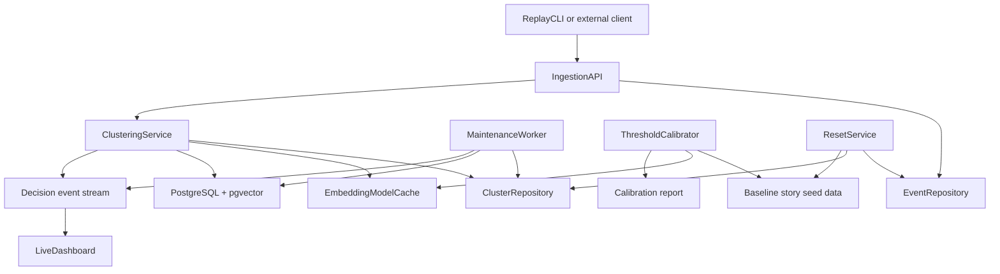

# Architectural Blueprint

## 1. Core Objective
Build a distributable demo that continuously ingests text events, assigns each event to a recent cluster or creates a new one, exposes the decision through a clean API, and lets an interviewer replay a deterministic baseline story, reset the state, and inspect the system live from a terminal dashboard. Success means the demo is easy to run on one machine, easy to explain in 5 to 10 minutes, and consistent about why an event joined, became a draft cluster, or was merged later with stronger evidence.

## 2. System Scope and Boundaries
### In Scope
- Continuous event ingestion over HTTP for text payloads and timestamps
- Exact-dedupe fast path and semantic recent-cluster matching
- Configurable draft band using shared config values
- Background merge correction for recent draft clusters
- Deterministic replay of a baseline story
- Reset flow that wipes mutable database state and restores the baseline story
- Threshold calibration from labeled replay data
- Live terminal dashboard driven by SSE
- Local model cache behavior documented for interview use

### Out of Scope
- Multi-tenant authentication and authorization
- Cross-region or multi-node coordination beyond one PostgreSQL instance
- Production autoscaling, HA failover, and zero-downtime deployment
- Human-in-the-loop relabeling or retroactive cluster splitting
- Long-term archival analytics beyond the active demo data set

## 3. Core System Components
| Component Name | Single Responsibility |
|---|---|
| **IngestionAPI** | Accept events, expose cluster-inspection endpoints, and stream live decision updates. |
| **ClusteringService** | Normalize events, compute scores, and decide join versus create-draft. |
| **ClusterRepository** | Persist and query cluster state, sparse semantic centroids, projection centroids, exemplars, and merge audit data. |
| **EventRepository** | Persist immutable event records, normalized fingerprints, replay metadata, and event-level embedding rows. |
| **MaintenanceWorker** | Periodically merge recent draft clusters and backfill missing semantic embeddings when stronger semantic data becomes available. |
| **ReplayCLI** | Replay the deterministic baseline story, send live test events, and trigger resets. |
| **LiveDashboard** | Render the live event stream alongside an in-memory active-cluster and recent-merge view for the operator. |
| **ThresholdCalibrator** | Run a pure domain simulation over labeled replay data and emit a calibration report without DB side effects. |
| **ResetService** | Wipe mutable demo state and re-insert the baseline story without removing Docker volumes. |
| **EmbeddingModelCache** | Keep the local embedding model in `.cache/` and make that cache reusable across runs. |

## 4. High-Level Data Flow

## 5. Key Integration Points
- **ReplayCLI <-> IngestionAPI**: HTTP `POST /events` with JSON payloads containing `event_id`, `source`, `occurred_at`, `text`, and optional metadata; no auth in the local demo by default.
- **IngestionAPI <-> ClusteringService**: in-process Python call carrying normalized text, embedding vector, and request-scoped trace fields.
- **ClusteringService <-> ClusterRepository**: SQL plus pgvector similarity queries over `semantic_embeddings` or `projection_embeddings`, transaction-scoped advisory lock acquisition, and merge-audit writes.
- **ClusteringService <-> EventRepository**: immutable event insert, idempotency lookup by `event_id`, normalized fingerprint lookup, and separate projection/semantic event-vector persistence.
- **ClusteringService / MaintenanceWorker <-> runtime_state**: a shared `semantic_ready_for_active_window` flag coordinates when the system may safely switch from projection retrieval to semantic retrieval for the active reuse horizon.
- **IngestionAPI <-> LiveDashboard**: SSE over `text/event-stream` on `GET /events/stream`, carrying assignment and merge events in JSON lines.
- **MaintenanceWorker <-> ClusterRepository / EventRepository**: periodic scans of draft clusters, centroid/exemplar evidence reads, merge transactions, and semantic-vector backfill for rows left empty during model-unavailability windows.
- **ThresholdCalibrator <-> baseline story / EmbeddingModelCache**: pure domain simulation over labeled seeded data plus the active embedding path, with Markdown and JSON report generation and no database side effects.
- **ResetService <-> EventRepository / ClusterRepository**: transactional truncate/delete of mutable demo rows plus deterministic seed reload from the baseline story bundle, with optional immediate live-state rehydration for one-click restore.
- **EmbeddingModelCache <-> ClusteringService / MaintenanceWorker**: local filesystem model loading under `.cache/`, mounted into the API container so the packaged Docker demo can reuse a cached sentence-transformers model after first warmup while still maintaining a deterministic stable-projection companion vector and later backfilling sparse semantic rows when semantic embedding is available.
